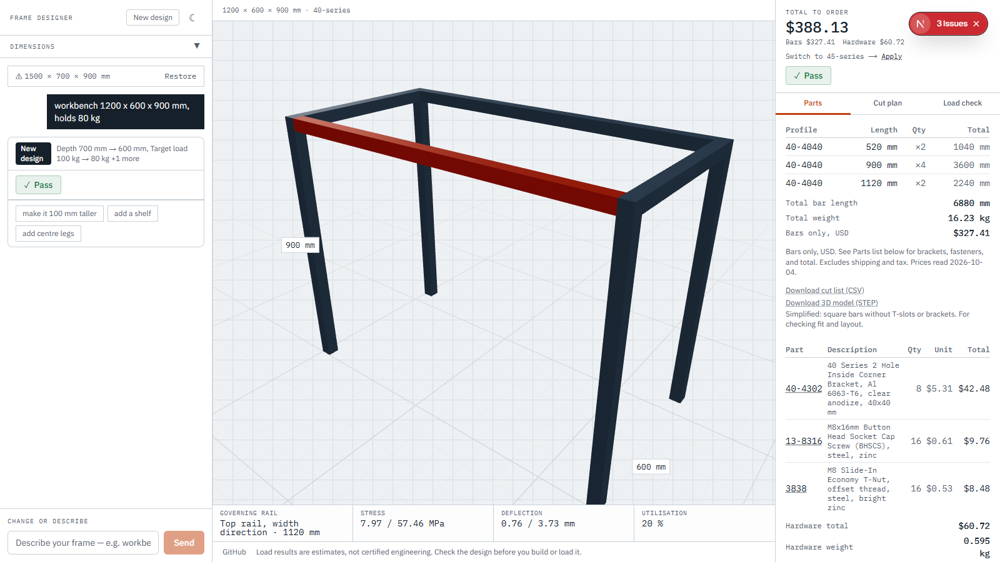
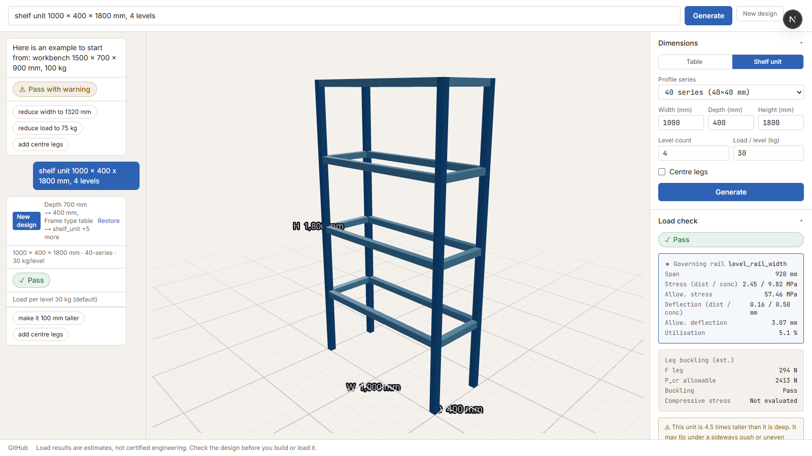
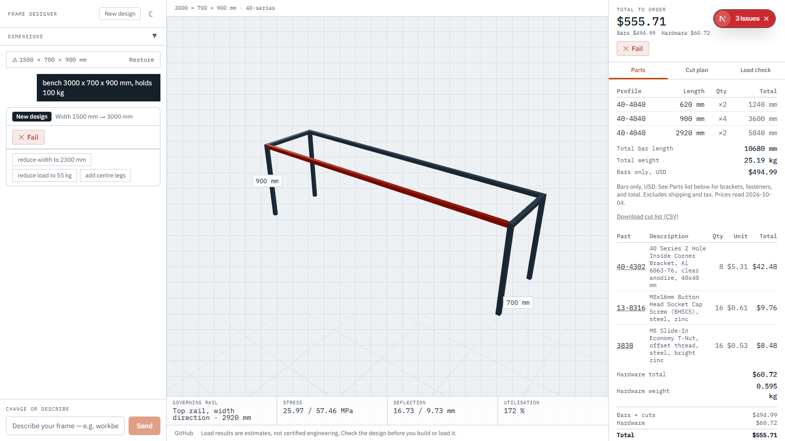

# Frame Designer

[](https://github.com/nati5174/FrameForge/actions/workflows/ci.yml)

Type a description of the frame you need and get a 3D model, cut list, load estimate, and verified fix suggestions.



## What it does

- **Text input** — describe the frame in plain language: `workbench 1500 × 700 mm, holds 100 kg, lower shelf`
- **3D viewer** — interactive model you can rotate, with dimension labels
- **Cut list** — every bar with its exact length, weight, and cost, grouped by profile; $3.00 cut charge per bar
- **Profile choice** — 20-, 30-, 40-, and 45-series aluminum extrusion (T-slot)
- **Load estimate** — beam-bending and (for shelf units) leg-buckling checks; labelled as estimates with a stated safety factor
- **Fix suggestions** — when a frame fails the load check, up to three verified alternatives (smaller span, reduced load, centre legs), each confirmed to pass before being shown; a cheaper-profile suggestion when the frame passes



## How it works

```
text request → parser → FrameSpec → generate → Frame → checks → cut list + suggestions
```

The LLM is called in two places only: extracting the `FrameSpec` from text, and optionally ranking and wording the fix suggestions. All geometry, bar counts, lengths, load numbers, and check results come from deterministic Python code. The same spec always produces the same frame and the same numbers. The core runs without an API key.

## How to run

Requires Python 3.11+ and Node.js.

**API key** (required for natural-language input and ranked suggestions):

Create `.env` in the repo root:

```
ANTHROPIC_API_KEY=sk-ant-...
```

Or set it in your shell:

```powershell
# PowerShell
$env:ANTHROPIC_API_KEY = "sk-ant-..."
```

```bash
# bash / zsh
export ANTHROPIC_API_KEY=sk-ant-...
```

**Start both servers** (from the repo root):

```bash
pip install -e ".[dev]"
python scripts/dev.py      # frees ports, starts backend and frontend, waits for /health
```

Or start them separately:

```bash
uvicorn framegen.api:app   # terminal 1 — backend on :8080
cd frontend && npm install && npm run dev  # terminal 2 — frontend on :3000
```

## Load estimate

This is an estimate, not a structural certification.

### Tables and workbenches

Each top rail is modelled as a simply supported beam. Two load cases:

- **Case (a) — distributed (headline pass/fail):** load spread evenly; each of two parallel rails carries half the total as a UDL
- **Case (b) — concentrated (warning):** full load as a point force at midspan of one rail; does not override the headline result

Constants: safety factor **3.0** on yield stress; deflection limit **L / 300**.

### Shelf units

Each level's rails are checked with the same two load cases, using `load_per_level_kg` as the load. Leg buckling is checked with K = 2.0 (fixed-free) over the full height, assuming the unit is wall-anchored or braced against racking — K = 2.0 is unconservative for a freestanding unit that can sway. The compressive stress sub-check is not evaluated because the vendor publishes no cross-section area. Tipping is a rule-of-thumb H/D ratio warning and does not affect the pass/fail.

For everything not covered — joint failure, racking, dynamic loads, shear stress, stress concentrations, self-weight, and others — see the in-app "Not covered" list in the load panel.

If any required catalog value is missing, the check returns `not_evaluated` rather than a false pass.



## Evaluation

All scores from a single run on 2026-10-04, commit `804be4d`. LLM scores can vary by a case between runs.

### Parser — dev set (56 cases, groups A–O)

| Config | Total | A | B | C | D | E | F | G | H | I | J | K | L | M | N | O |
|---|---|---|---|---|---|---|---|---|---|---|---|---|---|---|---|---|
| rule_based | 48/56 | 8/8 | 2/2 | 3/3 | 4/4 | 3/3 | 6/6 | 1/4 | 3/8 | 2/2 | 6/6 | 3/3 | 2/2 | 3/3 | 1/1 | 1/1 |
| llm | 50/56 | 7/8 | 2/2 | 3/3 | 3/4 | 2/3 | 6/6 | 4/4 | 7/8 | 2/2 | 6/6 | 3/3 | 2/2 | 2/3 | 0/1 | 1/1 |
| dispatcher | 56/56 | 8/8 | 2/2 | 3/3 | 4/4 | 3/3 | 6/6 | 4/4 | 8/8 | 2/2 | 6/6 | 3/3 | 2/2 | 3/3 | 1/1 | 1/1 |

### Parser — regression set (21 cases, groups A–H)

| Config | Total |
|---|---|
| rule_based | 20/21 |
| llm | 19/21 |
| dispatcher | 21/21 |

### Edit — dev set (45 cases)

Groups: add, casual, clarify, clarify_no_number, compound_llm, keep_other_fields, load_question, new_design_signal, profile_switch, set, shelf, shelf_unit_levels, spec_invalid, type_change, unsupported, unsupported_unusual, word_numbers, wrong_field.

| Config | Total |
|---|---|
| rule_based | 32/45 |
| llm | 45/45 |
| dispatcher | 45/45 |

### Edit — regression set (10 cases)

All three configurations: **10/10**.

### Suggestions

Structural fixes (5 cases): validity 5/5, coverage 5/5, count 5/5, minimality 5/5.
Cost suggestion (3 cases): **3/3**.

## Tech stack

- **Backend:** Python 3.11, FastAPI, Pydantic v2
- **Frontend:** Next.js 16 (App Router), TypeScript, Tailwind CSS v4, React Three Fiber / drei
- **LLM:** Claude Haiku (`claude-haiku-4-5-20251001`) via Anthropic SDK — parser and suggestion ranking only
- **Tests:** pytest (backend), Vitest + React Testing Library (frontend), Playwright (E2E smoke test)
